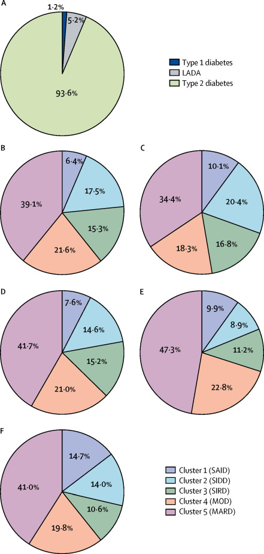
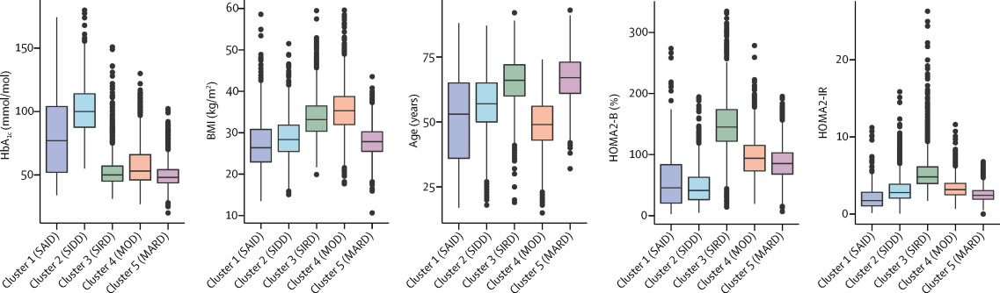
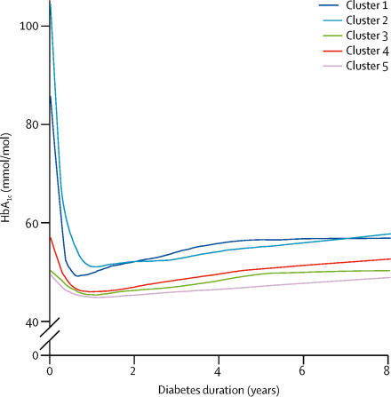
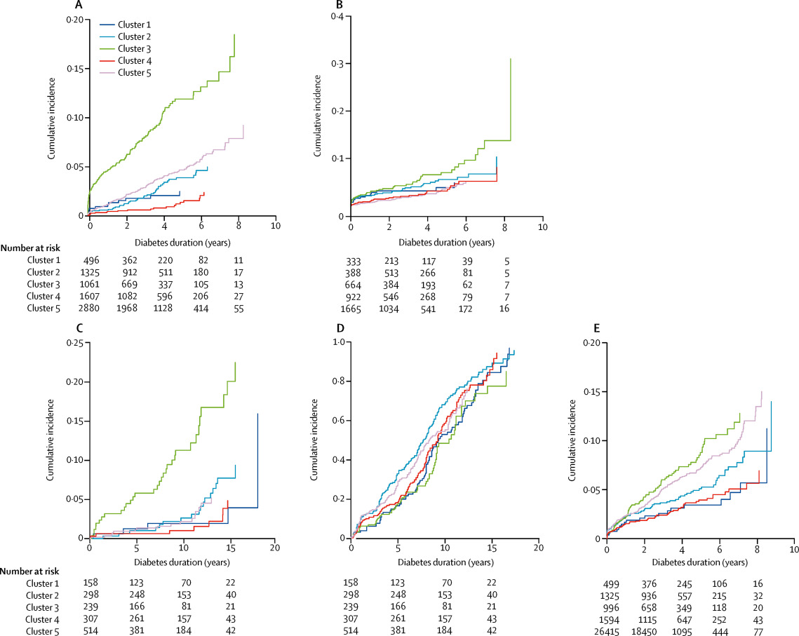

## 专家观点（北京协和 肖新华）
### 当前分型存在问题
- 不能满足时代对于精准医学的需求；
- 不能有效预测患者的临床转归；
- 不能解释为何有些患者更容易出现并发症；
- 不能预测哪些患者对何种治疗手段更加敏感，哪种药物又能给患者带来更多获益

### 糖尿病分型困难的主要原因
- 遗传背景复杂性
- 环境因素可变性
- 发病机制多元性
- 临床表现多样性
- 检测技术局限性

### T2DM精准分型需要“综合性视角” 
- 结合基因组学、蛋白组学、表观遗传学、环境因素等
- 综合患者的胰腺发育情况、胰岛功能、糖尿病相关抗体、肠促胰素活性、脂肪分布、IR等临床表型进行分型讨论
- 同时将患者的疾病进展、对药物的治疗反应一起纳入分型体系

---

## 精确分型研究
### [Identification of type 2 diabetes subgroups through topological analysis of patient similarity](https://www.ncbi.nlm.nih.gov/pmc/articles/PMC4780757/) Science translational medicine. 2015;7(311):311ra174.

#### 摘要
糖尿病患者有不同表现和不同并发症敏感性。用电子病历系统EMR结合表型将11210病人分出三个亚组（临床和基因都各有特点）：

- **Subtype 1:** 以糖尿病肾病和糖尿病视网膜病变为特征。1279 SNPs mapped to 425 unique genes。
- **Subtype 2:** 多伴恶性肿瘤和心血管疾病。1227 SNPs mapped to 322 unique genes。
- **Subtype 3:** 与心血管疾病、神经疾病、过敏、HIV感染最强相关。1338 SNPs mapped to 437 unique genes。

基因水平反映的表型和生物学功能与基于电子病历系统的疾病并发症和临床差异吻合。

#### 前言
糖尿病患病率极高且不断增加，危险因素多样，并发症多，给患者健康和经济带来重大负担。需要增加对其了解以便于预防、早期诊断、改善临床干预。

对T2D的精细表型分析可以增加对其病理生理学的理解。目前分类：T1D、T2D、MODY，其他的亚型基于表性特征，说明传统的分型可能包含了更加精细的亚型。白宫II纵向队列研究表明对T2D根据血糖水平分析可改善对其心血管风险的评估。基因关联分析也表明T2D的基因结构极为复杂。危险因素也存在很大的异质性。临床和基因的复杂和异质性说明可以对当前症状为基础的T2D分型更精细分型。

基于T2D病因学和病理生理学的异质性，提出科学假设：对临床人群的数据分析可以找出新的T2D亚型和因素。
开发了一个data-driven, topology-based方法：(i) 用电子病历系统的临床数据描述T2D病人的复杂性；(ii) 用临床和基因特征寻找新的T2D亚型。
将这种方法应用于>11000病人，拓扑分析分出3种T2D亚型具有不同的临床特征和并发症。每种亚型的基因差异进行基因和通路功能分析。生化表型和基因分析能很好地匹配。说明该方法可以很好地改善对T2D的认识进而治疗。

#### 方法
- 实验设计

    根据临床表型特征进行相似度拓扑分析，对2型糖尿病进一步分型。每一个亚型进行并发症-SNPs-生物功能分析。
    
    （develop a precision medicine approach to better understand and to characterize the complexity of T2D patient populations through data-driven, topological analysis of patient-patient similarity across clinical phenotype traits. ）
- 人群

    美国西奈山门诊的11210名病人。男:女=6857:4350。
- 基因组和基因突变分析

    genome-wide Illumina OmniExpress and Illumina Human Exome BeadChip arrays。...
- 临床表型数据分析

    “假性横断面研究”。入组为D1，D1前后30天内实验室检查、重要检查、服药、自报人口学特征为首次数据；最后一次检查为D1至D1+30天内；病人的ICD-9-CM编码、服药日期在D2内的，给予赋值。**eMERGE network**不断更新、检查、抽样质控。形成矩阵：11,210人, 505临床指标(480临床试验指标), 7097 unique ICD-9-CM codes (1 to 218 per patient).平均每个病人有64（25-212）个临床指标。选出超过一半的病人都有的指标一共73个。
- 疾病分类

    根据ICD-9-CM编码，用281个单水平CCS和18个多水平大类CCS对疾病进行区分。
- 病人网络拓扑分析

    对病人的临床特征用基于TDA的方法进行无监督聚类 [Ayasdi 3.0](https://www.ayasdi.com/)
- 统计分析

    用TDA建立病人相关网络；用IPA对区分亚组的基因进行通路分析；SNPs超几何分析；

#### 结果
1. T2D-specific patient network

    对11210人根据无聚类拓扑分析临床表型（EMR中的临床数据，>500个的人口学特征、实验室检查和用药），具有相似性的患者聚集在一起。共分[两组](https://www.ncbi.nlm.nih.gov/pmc/articles/PMC4780757/figure/F1/?report=objectonly)。一组n=3889，多含内分泌与代谢病、免疫疾病、感染性疾病、精神疾病、循环和泌尿生殖系疾病及其他不健康症状。另一组n=7321，多有妊娠、呼吸系统疾病并发症等。

    对2551名T2D病人，根据73个临床指标，分成三组：subtype1-762人，subtype2-617人，subtype3-1096人。性别无差异。

    检验可重复性。将2551人随机分为训练组和验证组（2:1）。用73个临床指标进行10次交叉验证并检验准确度（阳性预测值和灵敏度）。在训练组中，三个subtype的10次阳性预测值分别为100，91，98%，灵敏度分别为99，96，94%。在验证组中，三个subtype的10次阳性预测值分别为100，90，97%，灵敏度分别为99，96，93%。总准确度为96%。

2. T2D不同subtype的特点和临床特征

    找到这三个亚型中分别特有（和另外两组有显著性差异）的[临床指标](https://www.ncbi.nlm.nih.gov/pmc/articles/PMC4780757/table/T1/?report=objectonly)，分别29个，3个，11个。

    S1：年轻，典型T2D特征，高BMI和血糖，血常规低。低板，血凝差。高血白蛋白和低肌酐。生功能好但是GFR低。高血CO2和低呼吸次数。较少使用CCB，ACEI/ARB，DPP4，MET。

    S2：体重在三组中最低。
    
    S3：高收缩压、血氯、肌钙蛋白，多ACEI/ARB和他汀。

3. T2D不同亚型相关的的并发症

   用CCS将7000个ICD-9-CM编码进行归类，单水平281类和多水平18个大类。校正性别、年龄、种族后，发现[不同亚型的不同并发症](https://www.ncbi.nlm.nih.gov/pmc/articles/PMC4780757/table/T2/?report=objectonly)及OR值。

   S1：其他上感、感染免疫、糖尿病和并发症、其他皮肤病、视力障碍

   S2：气管癌、结核、冠心病、循环疾病

   S3：HIV、外伤护理、动脉栓塞、高血压、冠心病、过敏、贫血、精神疾病

4. 不同亚型的基因变异（独立于临床数据）

    基因变异超几何分布富集分析，三个亚型中分别有1279，1227，1338个基因变异。分别mapping到425，322，437个基因。
    
    [基因-表型网络图](https://www.ncbi.nlm.nih.gov/pmc/articles/PMC4780757/figure/F2/?report=objectonly)用Cytoscape 3.2.0。

    [疾病相关基因变异富集表型](https://www.ncbi.nlm.nih.gov/pmc/articles/PMC4780757/table/T3/?report=objectonly)用VarDi。分别29个2型糖尿病相关，25个肿瘤和心血管相关，28个精神神经、心血管相关gene-phenotype associations significantly enriched among the genetic variants。

5. 不同亚型特异的通路和功能：IPA (p<0.01>)

    Canonical pathways analysis 分别有[5，2，6个通路](https://www.ncbi.nlm.nih.gov/pmc/articles/PMC4780757/table/T4/?report=objectonly)与三个亚型相关。

    [9，3，3个毒性功能](https://www.ncbi.nlm.nih.gov/pmc/articles/PMC4780757/table/T5/?report=objectonly)  S1：肾功能和肝功能；S2和S3：心脏动脉病

以上结果说明，电子病历系统采集到的数据分型和基因层面的分型单独分型，结果却能够很好的匹配。目前临床上的T2D实际上包含了更加精细的分型。不同亚型之间基因层面的区别深植于和临床差异相关的生物学差异。对生物标志物的发现或者疾病机制的理解提供新机会。

#### 讨论
- 以往的研究多仅仅关注临床表型做分型，然而表型组学的目标是发现多效基因-表型关联。我们根据临床表型拓扑分析分亚组，作为临床和基因危险因素的基础。

- 2551名T2D分出三组分别占30%，24%，43%，有不同的并发症。不同的SNPs和基因。独立分析却能匹配。

- 网络拓扑分析基于EMR的>500个临床变量，包括人口学、实验室检查和用药。三组的疾病、指标和基因特征。

- 样本量小、假阳性率、疾病轨迹初次诊断不明、疾病诊断和表型有限

- imput千人基因组、为其他复杂多因素疾病提供范式、从临床资料入手反向基因、可以扩大验证、对T2D的了解进而预防

---

### [Novel subgroups of adult-onset diabetes and their association with outcomes: a data-driven cluster analysis of six variables](https://www.ncbi.nlm.nih.gov/pubmed/?term=Novel+subgroups+of+adult-onset+diabetes+and+their+association+with+outcomes%3A+a+data-driven+cluster+analysis+of+six+variables.) The lancet Diabetes & endocrinology. 2018;6(5):361-9.

#### 摘要
用6个临床指标（谷氨酸脱羧酶、诊断时年龄、BMI、HbA1c、HOMA2-B、HOMA2-IR以及并发症和用药）聚类分析（k-means和层次聚类）8980名新诊断糖尿病（ANDIS），并在SDR（n=1466）、ANDIU（n=844）、DIREVA（n=3485）三个人群中验证。Cox回归和逻辑回归分析开始用药时间、达到缓解时间、并发症和基因之间的关系。

根据疾病病程和并发症一共分成5类。

This new substratification might eventually help to tailor and target early treatment to patients who would benefit most, thereby representing a first step towards precision medicine in diabetes。

#### 方法
- 人群

    选自5个队列：
    All New Diabetics in Scania (**ANDIS**) 14625人, 
    the Scania Diabetes Registry (**SDR**) 7400人,
    All New Diabetics in Uppsala (**ANDIU**) 844人, 
    Diabetes Registry Vaasa (**DIREVA**) 5107人,
    Malmö Diet and Cancer CardioVascular Arm (**MDC-CVA**) 3300人非糖尿病.
- 测量
- 基因型
- 糖尿病和并发症定义
- 聚类分析
    BMI、糖尿病发病年龄、HOMA2-B、HOMA2-IR。GADA二分类。变量变换均值为0，SD为1。基于轮廓宽度估计最佳聚类数目以及聚类用SPSS。。。2000次交叉验证，Jaccard相似度>0.75。
- 统计分析
    。。。
#### 结果
- 用二步聚类对ANDIS队列男性（n=5334）和女性（n=3646）分别聚类为5类。在GADA阴性患者中用K-means聚类得到类似结果。Jaccard相似度>0.8，稳定性好。

    第一组SAID（严重自身免疫性糖尿病）（n=577,占6.4%）：基本上与1型糖尿病和LADA（成人潜伏性自身免疫性糖尿病）相对应，其特征为年轻时发病，低BMI，代谢控制不良，胰岛素产生受损，以及存在GADA抗体。

    第二组SIDD（严重胰岛素不足型糖尿病）（n=1575,占17.5%）：包括HbA1c水平高，胰岛素分泌受损和中度胰岛素抵抗的个体。这组患者发生视网膜病的几率最高。

    第三组SIRD（严重胰岛素抵抗性糖尿病）（n=1373,占15.3%）：以肥胖和严重的胰岛素抵抗为特征。这组患者发生肾损伤的几率最高。

    第四组MOD（轻度肥胖相关性糖尿病）（n=1942,占21.6%）：包括在相对年轻时患病的肥胖患者，肥胖但没有严重胰岛素抵抗。

    第五组MARD（轻度年龄相关性糖尿病）（n=3513,占39.1%）：是最大的组，占所有患者的40%，其中大部分是老年患者。

    在SDR（n=1466）、ANDIU（n=844）、DIREVA（n=3485）三个人群中验证。
    SDR：最佳聚类数目同样是5，k-means聚类和二步聚类得到类似结果（92.4%）。病人分布和特征类似ANDIS。Jaccard bootstrap means>0.8。
    ANDIU的k-means聚类结果类似ANDIS。
    在DIREVA中，2607位具有较长糖尿病病程的患者和878位新发糖尿病患者的结果类似。

     
    

- 在ANDIS队列中比较疾病进展、治疗和并发症发生。

    G1和G2在诊断时HbA1c就高且在病程中都高。在诊断时最多酮酸中毒的是G1和G2。HbA1c是酮酸中毒的危险因素。G3中NAFLD患病率最高。

    胰岛素用药在G1组中42%，G2组中29%，G3、4、5中都低于4%。需要胰岛素时间G1<G2<G3、4、5。二甲双胍应用在G2组最多，G1最少，G3也少（实则是最需要的）。G2最快需要二线口服降糖药和最长时间达到控制目标。

    
    

    ANDIS中G3最可能发生慢性肾脏病和糖肾。在SDR和DIREVA中得到验证。
    ANDIS中G2有早期糖网征象。在ANDIU和SDR中验证。

    

    以MDV-CAV中的非糖尿病人群为对照，没有哪个基因是与所有组都有差异的。ANDIS中每个组与之比较得出差异基因。

#### 讨论
在诊断时就能鉴别出可能的并发症，可能机制，指导治疗。可被其他研究重复。网页版的分类工具正在开发。

SAID和T1D、LADA重叠，SIDD和SIRD是传统T2D中的新亚型，需要强化治疗。SIRD组肾脏并发症高，说明胰岛素抵抗和肾脏病之间的关系，而HbA1c相对低，说明降糖不是预防肾脏并发症的最佳选择。SIDD可以看出胰岛素不足和高血糖和糖网相关。

新诊断和长病程结果一致，说明方法可靠且分组依据不是按病程长短。肝脏胰岛素抵抗是NAFLD的一个特征，因为TM6SF2基因的SNP（NAFLD相关）在SIRD组中相关，MOD中则不然。

后续研究可以增加变量进行聚类，如生物标志物、基因型或基因危险得分。GWAS可以更加阐明各组差异。其他种族。更多自身抗体。并发症的其他危险因素也应纳入分析。
